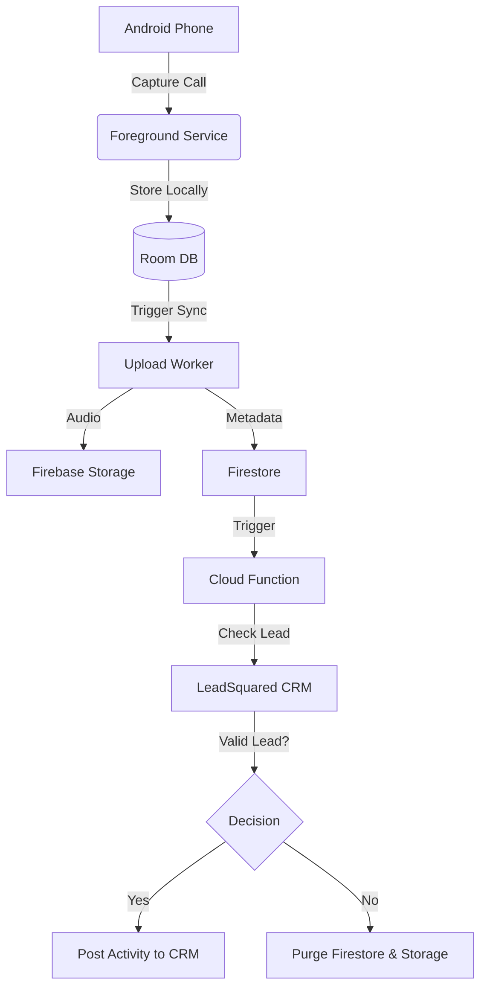

# Architecture: CloudTrack 🏗️

CloudTrack is a distributed system consisting of an **Android Agent** and a **Firebase/CRM Cloud Gateway**.

## System Flow

## Component Breakdown

### 📱 Android Application
- **CallLogObserver**: Monitors system call logs for metadata.
- **WhatsAppListenerService**: Captures WhatsApp/Data call events via notifications.
- **AudioRecordingService**: Handles background audio capture with priority elevation.
- **FirebaseManager**: Orchestrates secure uploads to GCP.
- **History UI**: A real-time Firestore viewer that streams audio directly from the cloud.

### ☁️ Firebase Cloud Layer
- **Cloud Functions (2nd Gen)**: Node.js serverless environment. Uses Axios for CRM integration.
- **Firestore (named: cloudtrack)**: High-performance metadata storage.
- **Firebase Storage**: Secure audio vault.

### 📞 Third-Party Integration
- **LeadSquared CRM**: The final destination for business activity.
- **API Endpoints used**:
  - `RetrieveLeadByPhoneNumber`: Verifies prospect existence.
  - `ProspectActivity.svc/Create`: Posts synchronized call activities.

## Data Minimization Strategy
To stay lean and privacy-compliant, the architecture follows an **"Upload then Verify"** pattern:
1. App uploads everything (to keep secrets secure in the cloud).
2. Server verifies the lead.
3. Server purges non-lead data immediately.
