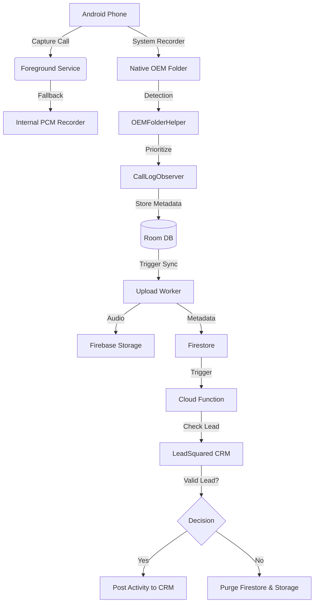

# Architecture: CloudTrack 🏗️

CloudTrack is a distributed system consisting of an **Android Agent** and a **Firebase/CRM Cloud Gateway**.

## System Flow

## Component Breakdown

### 📱 Android Application
- **CallLogObserver**: Monitors system call logs. It uses **OEMFolderHelper** to scan manufacturer-specific folders (Samsung, Xiaomi, OnePlus, etc.) for high-quality native recordings (`.m4a`, `.mp3`).
- **AudioRecordingService**: Acts as a real-time fallback by recording raw PCM audio when native recording is unavailable or blocked at the hardware level.
- **WhatsAppListenerService**: Captures WhatsApp/Data call events via notification listening.
- **FirebaseManager**: Orchestrates secure uploads to GCP.
- **History UI**: A premium native interface for streaming cloud-synced recordings.

### ☁️ Firebase Cloud Layer
- **Cloud Functions (v2)**: Node.js serverless functions (e.g., `synccalltoleadsquared`) that handle CRM logic and data sanitization.
- **Firestore (named: cloudtrack)**: High-performance metadata storage for all synchronized call logs.
- **Firebase Storage**: Secure bucket for hosting encrypted/private audio assets.

### 📞 Third-Party Integration
- **LeadSquared CRM**: The destination for sales activity. Uses `RetrieveLeadByPhoneNumber` and `ProspectActivity.svc/Create` APIs.

## Data Minimization & Privacy
1. **Local-First**: Calls are briefly cached locally in Room and internal storage.
2. **Ephemeral Cloud Storage**: Audio is uploaded for CRM processing but is **permanently purged** by the Cloud Function if the caller is not a recognized lead.
3. **Secret Management**: All API keys are stored in Firebase environment variables, never in the Android source code.
