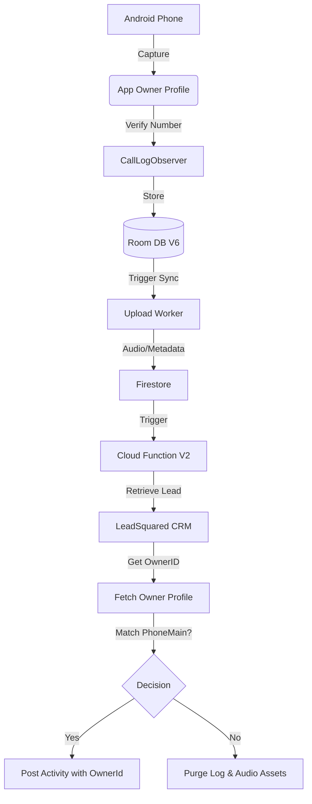

# Architecture: CloudTrack 🏗️

CloudTrack is a distributed system consisting of an **Android Agent** and a **Firebase/CRM Cloud Gateway**.

## System Flow

## Component Breakdown

### 📱 Android Application
- **App Owner Profile**: A manual configuration screen in `MainActivity` allowing users to save their verified phone number. This acts as the primary identity for LeadSquared owner matching.
- **CallLogObserver**: Monitors system call logs. It uses **OEMFolderHelper** to scan manufacturer-specific folders and incorporates the "App Owner Number" for reliable identity tracking.
- **WhatsAppListenerService**: Captures WhatsApp events, using the App Owner identity to ensure consistent tracking across both PSTN and VoIP platforms.

### ☁️ Firebase Cloud Layer
- **Cloud Functions (v2)**: Implements **Lead-Owner Verification**. It retrieves the lead's assigned owner from LSQ and cross-references their `PhoneMain` with the device's identity using normalized (digit-only) matching.
- **Firestore (named: cloudtrack)**: High-performance metadata storage for all synchronized call logs.
- **Firebase Storage**: Secure bucket for hosting encrypted/private audio assets.

### 📞 Third-Party Integration
- **LeadSquared CRM**: The destination for sales activity. Uses `RetrieveLeadByPhoneNumber` and `ProspectActivity.svc/Create` APIs.

## Data Minimization & Privacy
1. **Local-First**: Calls are briefly cached locally in Room and internal storage.
2. **Ephemeral Cloud Storage**: Audio is uploaded for CRM processing but is **permanently purged** by the Cloud Function if the caller is not a recognized lead.
3. **Secret Management**: All API keys are stored in Firebase environment variables, never in the Android source code.
